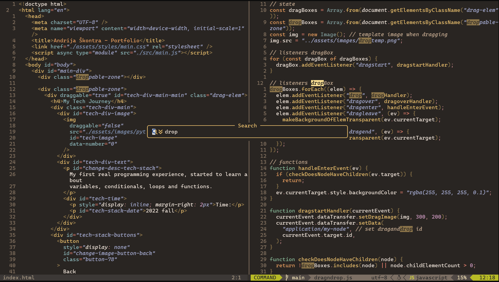

# Neovim

 

> [!CAUTION]
>
> This is a document for personal
> Neovim config hacks

- [x] keyboard only centric configuration
- [x] customize to your needs
- [ ] easy learning process 😸

## Tips and tricks

> [!NOTE]
>
> - '*' -> to search for the word on cursor
> - leader / -> search files
> - leader ds -> all variables, functions... in document 
> - leader ws -> all variables, functions... in workspace/project 
> - scroll docs ctrl b and f in autocomplete
> - <leader>sr :input symbol | Surround replace with symbol |
> - <leader>sh :input symbol| Fing matching symbol |
> - <leader>srt | Surround with custom tag |

| Useful snippets | Description |
| -------------- | --------------- |
| imn | import module |
| ednf | export default named function |
| useStateSnippet | useState snippet |

| Split window commands | Description |
| -------------- | --------------- |
| C-wv | split window vertically |
| C-wq | quit a window |
| C-wx | switch windows |

| Git keymaps | Description |
| -------------- | --------------- |
| leader hD | git diff from last commit in this file |
| leader hb | git blame [!WARNING]  might change |

## Todo

- [x] Make a cool looking cheatsheet
- [x] Add undotree space + su
- [ ] center screen after % jump
- [ ] switch to oil or nerdtree

