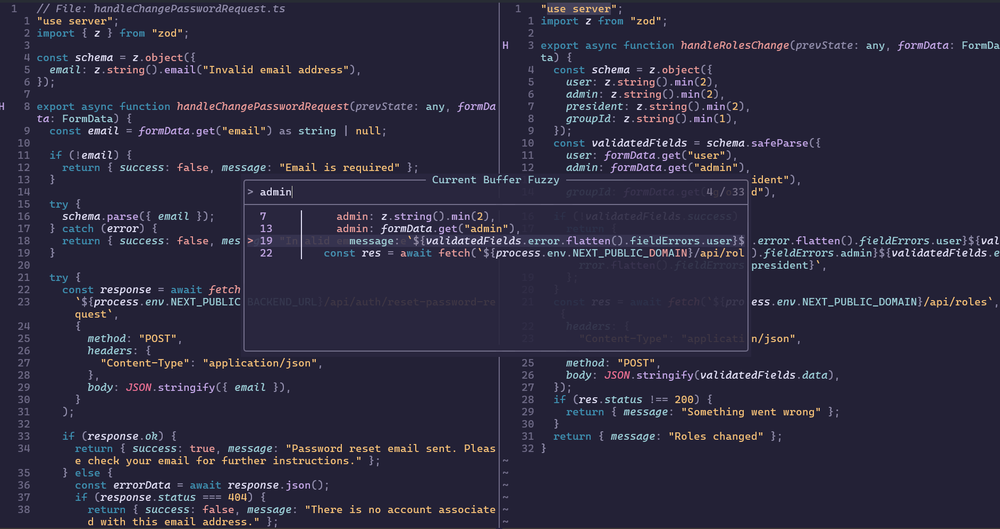
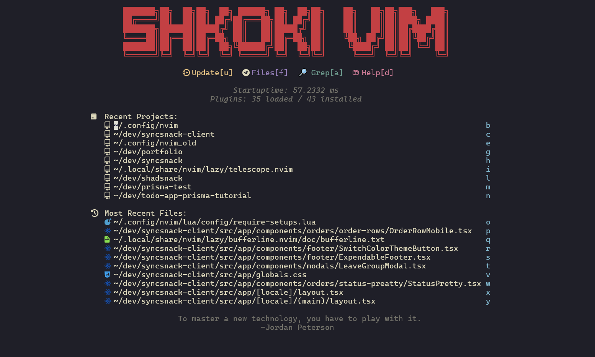
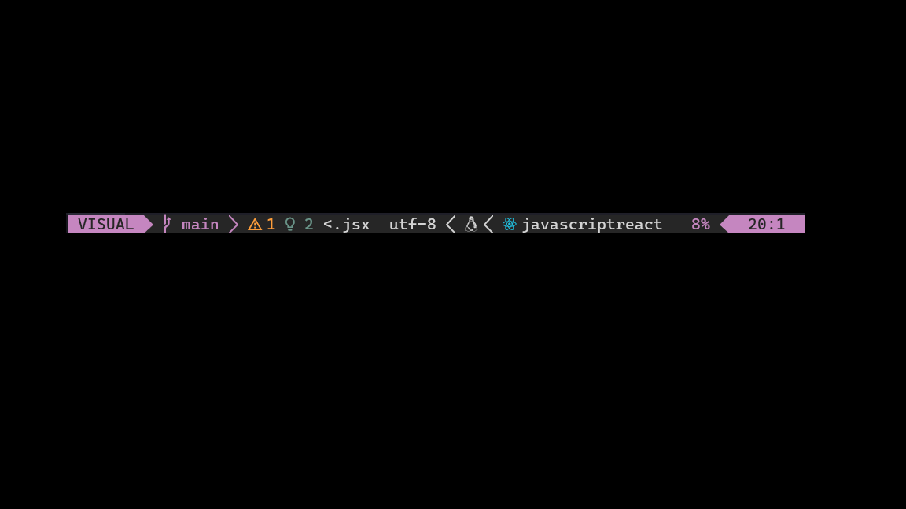

# Neovim

## Flow:

 

---

## Dashboard:

 

---

## Lua line:

 

---

> [!CAUTION]
>
> This is a document for personal
> Neovim config hacks

- [x] keyboard only centric configuration
- [x] customize to your needs
- [ ] easy learning process 😸

## Remapped commands

> [!IMPORTANT]
> "leader" key is space, but I will mark it with "<l>" 

| Navigation | Description |
| --------------- | --------------- |
| ctrl h/j/k/l | Move focused pane (left/up/down/right) |
| alt h/j/k/l | Fast navigation in text |

| Quick fix navigation | Description |
| --------------- | --------------- |
| <l> n | Goto next error |
| <l> q | Show list of possible fixes |

| Project files with Oil | Description |
| -------------- | --------------- |
| leader + e | open oil |
| g. | show hidden files |

> [!NOTE]
> If you don't like these remaps please change them as you see fit.
> For all remaps check **/lua/keymaps.lua**

## Useful commands

| Search Shortcuts | Mode | Description |
| --------------- | --------------- | --------------- |
| * | Normal | Search the word on cursor |
| <l> / | Normal | Fzf in current buffer |
| <l> ds | Normal | Search for all variables, functions, class names |
| <l> ws | Normal | Just like <l> ds but in whole project |
| <l> sr | Normal | Surround replace with symbol |
| ctrl b / ctrl f | Documentation on K press | Scroll up and down |
| <l> srt | Normal | Surround with custom tag |

| Useful snippets | Description |
| -------------- | --------------- |
| imn | import module |
| ednf | export default named function |
| useStateSnippet | useState snippet |

| Split window commands | Description |
| -------------- | --------------- |
| C-wv | split window vertically |
| C-wq | quit a window |
| C-wx | switch windows |

| Git keymaps | Description |
| -------------- | --------------- |
| leader hD | git diff from last commit in this file |
| leader hb | git blame [!WARNING]  might change |

## Todo

- [x] Make a cool looking cheatsheet
- [x] Add undotree space + su
- [x] center screen after % jump
- [x] switch to oil or nerdtree
- [x] better macro plugin => first macro saved <l>cc to comment jsx files
- [ ] plugin for visual information of previous and next buffers
- [ ] set up rest.nvim (for rest api testing)
- [ ] vim.test => plugin for easier testing
- [ ] add credo with nvim.lint (for elixir linter)
- [ ] fix the bug where the documentation window is to big
- [ ] visual mode comment jsx

